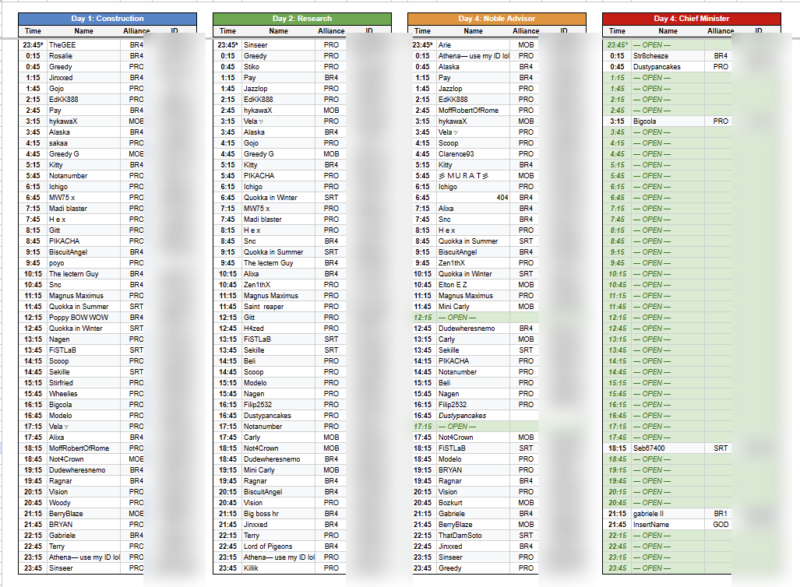
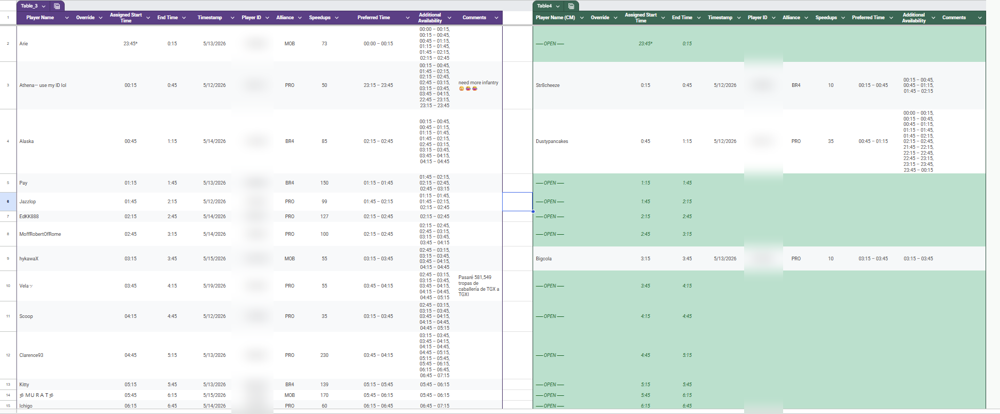
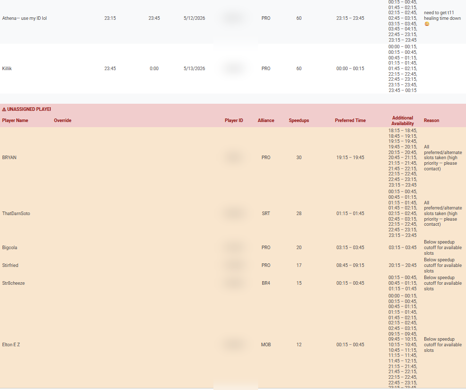

# Schedule Optimization Engine

A constraint-based scheduling engine that fits hundreds of Google Form sign-ups into a limited set of half-hour appointment slots across multiple days -- prioritizing entries by a weighted score when demand exceeds capacity. Built in Google Apps Script, runs entirely inside Google Sheets.

## Background

I help run a competitive mobile-game kingdom of ~500 players (my own alliance is about 100 of them) that holds a recurring event every 4 weeks. Each event spans 3 days, and everyone who signs up needs an individual 30-minute appointment window across a 24-hour UTC cycle. Players submit a Google Form with their preferred time and alternates, and I build the schedule from whoever responds.

The old process was painful:
- Hundreds of form entries to sort through by hand (each player signs up for up to 3 days)
- Took around 10 hours every cycle
- Placement was effectively first-come-first-serve -- I dropped each submission into the next open time in the order it arrived, so contribution (speedups) was never factored in
- A high-speedup player who signed up late ended up with leftover slots, and any last-minute change meant manually reshuffling everyone around them
- Players with lots of availability would grab the one slot that was another player's only option, locking them out
- Duplicate submissions and partial changes were a mess
- Day 4 has an overflow track (two positions instead of one) that was managed in a separate sheet

So I automated it.

## How it works

Players fill out a Google Form picking their preferred time and alternates for each day. The script processes signups in two modes:

**Live (on form submit):** each submission gets immediately slotted into the best available time on the Day sheets and Schedule. This is a quick first-come-first-served placement so players can see their tentative assignment right away.

**Batch (Reassign All):** when signups close, I run the full optimizer. It reads all submissions, picks the top 49 by contribution score, and assigns them using a constrained-first approach -- players with fewer available times get placed first so they don't get locked out by flexible players. Then a bump/swap pass lets high-value unplaced players displace lower-value ones. Leftover slots get backfilled.

For Day 4, Noble Advisor fills first (49 slots), then overflow players go to Chief Minister (another 49 slots), rendered side-by-side on the same sheet.

### The algorithm

> For a deeper walkthrough of the matching model, scoring, and edge cases, see [docs/algorithm.md](docs/algorithm.md).

1. **Select** the top 49 players by speedups (contribution score)
2. **Assign** them constrained-first (fewest available slots goes first)
3. **Bump/swap** -- if a top-49 player couldn't fit, find the lowest-value assigned player in one of their slots and relocate or displace them
4. **Backfill** remaining open slots with everyone else

This solved the main problem: Ekips (150 speedups, 33 available slots) used to grab the 02:45 slot, which was one of only 2 options for Wheelies (52 speedups). Now Wheelies gets placed first because they're more constrained, and Ekips goes into one of their 32 other options.

### Overrides

After the batch run, I can type overrides in column B on the Day sheets:

- `SKIP` -- exclude from this day (they still show at the bottom so I can see them)
- `ASSIGN` -- force them in even if below the speedup cutoff
- `CHIEF` / `NOBLE` -- move between the two Day 4 tracks
- A time like `09:45` -- lock to a specific slot

Overrides persist when I re-run. SKIP'd players show in the unassigned section instead of disappearing.

### Cycle management

The script handles the 4-week rotation automatically:
- Calculates next event dates from a rolling anchor
- Updates the Google Form title, description, and section dates (e.g. "KvK #11", "Monday, April 20th UTC")
- Clears all sheets and pre-populates the 49 time slots as OPEN
- Fires automatically 10 days before Day 1, or manually from the menu

### Other details

- **Crossover handling** -- the last person on Day 1 (23:45 slot) is the same as the first person on Day 2 (00:00 slot). The script figures out who that should be and reserves their Day 2 slot.
- **Duplicate detection** -- if someone resubmits the form for just one day, their other days stay unchanged. Full resubmission replaces everything.
- **Google Sheets table compatibility** -- the Day sheets use structured tables, which convert time strings to Date objects and block certain formatting calls. The script normalizes all time formats and wraps formatting in try/catch.
- **Concurrent submission safety** -- form submissions acquire a script lock to prevent two people from getting assigned the same slot.

## Screenshots

### The generated schedule

The final output: every 30-minute slot assigned across Day 1 (Construction), Day 2 (Research), and Day 4's dual tracks (Noble Advisor + Chief Minister), rendered side by side.



### Day 4 dual-track detail

Day 4 runs two parallel tracks. Noble Advisor fills first; overflow players go to Chief Minister, shown side by side with open slots highlighted in green.



### Unassigned players

Anyone who couldn't be placed is listed separately with the reason — either all their preferred/alternate slots were taken, or they fell below the speedup cutoff for the slots they were available for.



> Player IDs in these screenshots are intentionally blurred.

## Architecture

```
Google Form
    |  onFormSubmit trigger
Form Responses (sheet)
    |  readFormData() -- dedup + merge
Player objects (in memory)
    |  assignToTrack() -- multi-phase optimizer
Day Sheets (1, 2, 4)        Schedule Sheet
    |  writeTrack()              |  writeSchedule()
    |  writeCM()                 |  updateScheduleSlot()
    '-- Override col (B) --- persists across runs
```

## Tech

- Google Apps Script (V8 runtime)
- Google Forms API (`FormApp`) for programmatic form updates
- Google Sheets structured tables (typed columns, format normalization)
- Installable triggers (`onFormSubmit`, time-based daily check)
- `LockService` for concurrent submission safety
- `PropertiesService` for cycle tracking

## Limitations & future work

Things I'm aware of and would improve given time:

- **The optimizer is a heuristic, not provably optimal.** Constrained-first assignment plus a bump/swap pass handles the real cases well, but it's not a true maximum-weight bipartite matching -- there are contrived inputs where it leaves a slightly better arrangement on the table. A Hungarian-algorithm pass would close that gap.
- **Player Name is the identity key, not Player ID.** Merging on name means a rename or typo creates a duplicate record. Keying on the (stable) Player ID would be more robust.
- **Google Apps Script quotas.** Everything runs inside the 6-minute execution limit and trigger quotas. Current rosters (~80-100) are comfortably within bounds, but a much larger event could approach them.
- **Setup is manual.** Tables, headers, and triggers are created by hand. A one-click installer (or `clasp`-based deploy) would remove the footguns around exact header names.
- **Hardcoded structure.** Three days and the Day 4 dual-track are baked into `CONFIG`. Making day/track count fully data-driven would generalize it to other event formats.
- **No automated tests.** The assignment core is verified by hand against real signups. Unit tests around the matching logic would make refactors safer.

## Setup

1. Open your Google Sheet > Extensions > Apps Script
2. Paste `src/kvk_signup.gs` and save
3. Reload the sheet -- "KvK Signup" menu appears
4. Run "Setup Auto-Update" from the menu
5. Add a trigger: Triggers > + Add Trigger > `onFormSubmit` > From spreadsheet > On form submit
6. Create tables on Day sheets with headers: Player Name, Override, Assigned Start Time, End Time, Timestamp, Player ID, Alliance, Speedups, Preferred Time, Additional Availability, Comments
7. Day 4: create a second table in columns M-W with the same headers for Chief Minister

The script reads the form responses and sheets **by exact column header name** -- see [docs/form-fields.md](docs/form-fields.md) for the full field reference and accepted value formats.

## License

[MIT](LICENSE)
